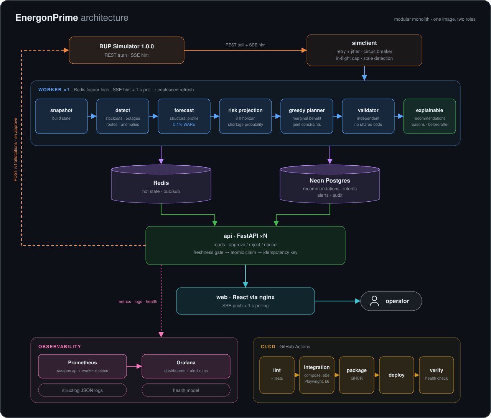
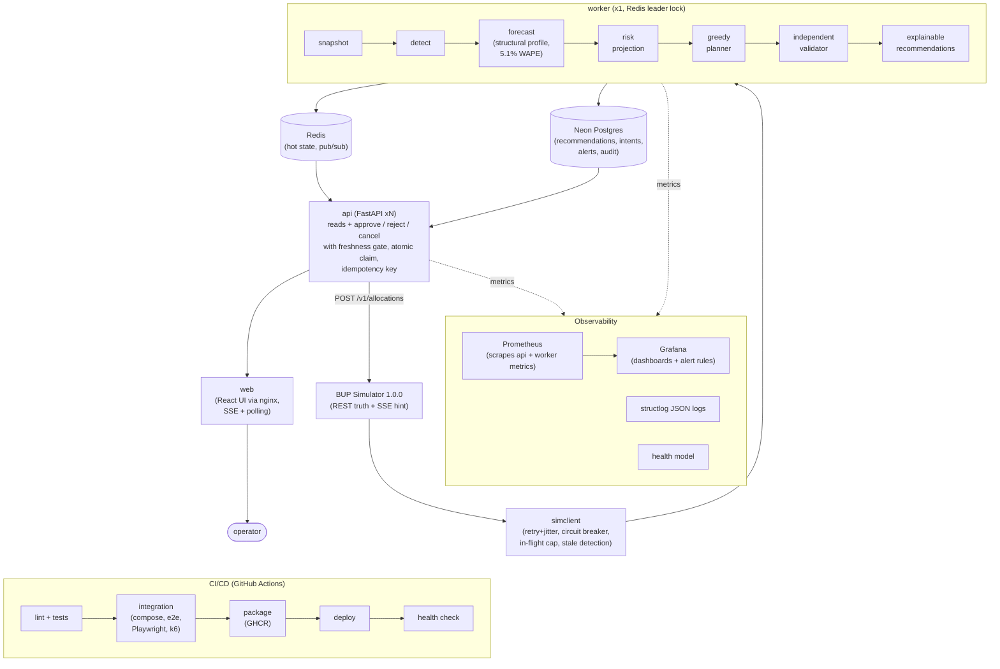

# FuelOps — Fuel Supply Intelligence & Resilience Platform

Decision-support platform for the **BUP Fuel Supply Simulator** (BUP CSE Fest 2026 finals).
It observes the simulated network, predicts stockouts, recommends explainable allocations,
executes them only after operator approval, and keeps working when parts of the system fail.
**Everything shown is simulated.**

`Observe → Detect → Predict → Decide → Simulate → Act → Monitor → Recover`

## Run it

```bash
cp .env.example .env              # optional: set DATABASE_URL for Neon; otherwise SQLite (degraded)
make up                           # simulator, redis, api, worker, web
open http://localhost:3000        # operator console
```

| URL | What |
|---|---|
| http://localhost:3000 | Operator console (React) |
| http://localhost:8080/api/v1/dashboard | API (FastAPI); `/healthz`, `/readyz`, `/metrics` |
| http://localhost:8000/admin | Simulator console (`SIM_HOST_PORT` to move it) |
| http://localhost:3001 | Grafana (`make up-obs`), Prometheus on :9090 |

The simulator starts **paused**. Use *Test Controls* in the UI (type `SIMULATE` to arm) to step,
run, reset, inject crisis scenarios or faults.

## Architecture (modular monolith: one image, two roles)

<p align="center">
  
</p>

<details>
<summary>Mermaid source</summary>



</details>

```
BUP Simulator 1.0.0 (REST truth + SSE hint)
      │  simclient: typed ACL, retry+jitter, circuit breaker, in-flight cap, stale header, SSE
      ▼
worker (x1, Redis leader lock) ── SSE hint + 1 s poll → coalesced refresh
      │  snapshot → detect → forecast (structural profile) → risk projection
      │  → marginal-benefit greedy → independent validator → explainable recommendations
      ▼
Redis (hot state, pub/sub)      Postgres/Neon (recommendations, intents, alerts, audit)
      ▼
api (xN, FastAPI) ── reads from Redis + L1; commands: approve / reject / cancel
      │  approve = freshness gate → re-validate → atomic claim → durable intent → POST → reconcile
      ▼
web (React, nginx) ── polling + SSE push; test plane dual-gated
Prometheus / Grafana / structlog JSON / health model across all of it
```

Layering is enforced by `import-linter` (`.importlinter`): the domain and intelligence packages
are pure, the replay validator shares no code with the planner, and decision code cannot reach
the admin test plane. Design docs: `docs/pipeline.md` (authoritative), `docs/architect.md`,
`docs/prd.md`; contract facts measured from the image: `docs/contract-findings.md`.

## Intelligence

- **Forecast:** published structural profile (daily base × region × hour-of-day × live multiplier).
  Measured one-step WAPE on live history: **5.1%** (DIESEL 4.8%, PETROL 5.1%, OCTANE 5.6%).
- **Risk:** tick-by-tick inventory projection over 8 simulated hours with inbound shipments;
  model-estimated shortage probability (normal approximation with profile noise + 5% systematic error).
- **Decision:** marginal-benefit greedy under joint constraints (route max shipment, station
  capacity incl. inbound, depot stock minus reserve, per-tick dispatch capacity), then an
  independent validator; each recommendation carries a comparison panel (no shipment /
  recommended / runner-up), binding constraint, reasons and before/after trajectories.
- **Detection:** stockout risk, outages, disrupted routes (with/without alternative), depot
  constraints, supply delay/shortfall, failed allocations, bottlenecks, demand anomalies
  (robust z > 3 twice, labelled "known demand event" when an event explains it), stale data.

## Resilience

| Failure | Behaviour | Verified |
|---|---|---|
| `stale_data` | state labelled stale, execution blocked, approve → `409 STATE_STALE` | live + e2e |
| `unavailable` | retries, circuit opens, last known state served with its age; recovers on clear | live |
| simulator reset | epoch++, recommendations superseded, alerts closed, history rebuilt | live + e2e |
| duplicate approvals | atomic claim + idempotency key → exactly one allocation | live (5 concurrent) + e2e (3) |
| recommendation superseded mid-review | dialog stays open, approval refused with `409 REC_NOT_ACTIONABLE` | live |
| request bursts vs simulator DB pool | in-flight cap keeps us under its 15 connections (0 pool errors) | compose |
| `error_rate` / `latency` | retries with jitter; latency shows as degraded, not errors | unit + contract |
| SSE drop | 1 s polling continues; reconnect → full REST resync | implemented, not yet scripted |
| ambiguous POST (timeout/503) | reconcile via `GET /v1/allocations` before one same-key retry | implemented, not yet fault-tested |
| Redis down | API serves its last good copy (HTTP 200), health → degraded; auto-recovers on restart | live (`evidence/resilience/`) |
| Postgres down | reads continue; reported in health | implemented, not yet tested |

## Evidence

- `evidence/phase-0/` — contract smoke (101/101 on clean runs, deterministic) + `tests/fixtures/contract/`
- `scripts/e2e_smoke.py` — risk → recommendation → 3 concurrent approvals → one allocation → ARRIVED,
  stale blocks approval, recovery (12/12)
- `evidence/phase-8/` — k6: 50 VUs p95 4.1 ms; 500 VUs 1,040 req/s p95 5.0 ms p99 27 ms, 0 errors
- `evidence/resilience/` — Redis outage: degraded → last-good state served → auto-recovery
- `evidence/security/` — npm audit + pip-audit: 0 known vulnerabilities
- `docs/DEMO.md` — judge demo run-sheet
- `make test` (53 unit/contract tests), `make lint` (ruff, mypy, import-linter, tsc), `make ui-test` (Playwright)

## Development

```bash
uv sync && (cd frontend && npm ci)
docker compose up -d simulator-api redis
make dev-worker   # terminal 1
make dev-api      # terminal 2
make dev-web      # terminal 3 → http://localhost:5173
```

Configuration is environment-only (`.env.example`); no secrets are committed. `APP_ENV=public`
forces API-key auth and disables the test plane.
