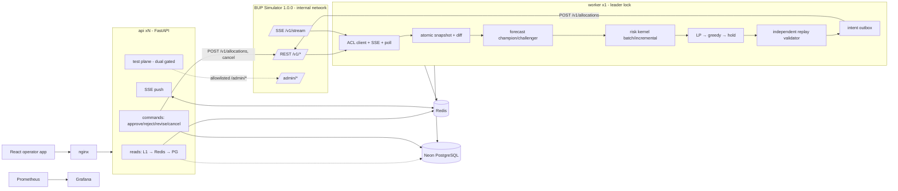
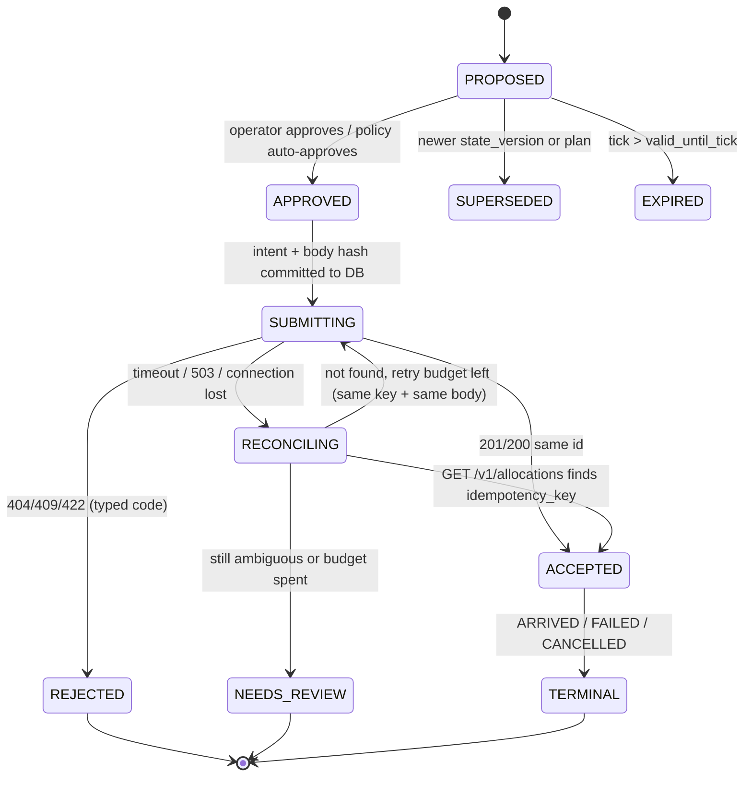

# Final Engineering Pipeline — BUP Fuel Supply Intelligence & Resilience Platform

| | |
|---|---|
| **Status** | Final build pipeline v1.0, 2026-09-29 |
| **Supersedes** | `PIPELINE_1.md` (other agent's draft). This file merges its strongest points with `prd.md` and `architect.md`. |
| **Detail lives in** | `prd.md` (requirements, targets), `architect.md` (design, formulas, schema, API). This file is the build order, the rules, and the defense. |
| **Sources, in precedence** | Simulator Integration Guide → Hackathon Finals brief → Shila's requirements (FastAPI, Redis with fallbacks, DevOps-ready, stress + normal load, efficient scoring) → labelled engineering decisions → optional enhancements |
| **Core principle** | Build the smallest complete platform that is correct against the simulator contract, useful to an operator, safe under failure, measurable, and easy to defend. |

**Label conventions (adopted from PIPELINE_1).** *Source Requirement* = required by official material. *Engineering Decision* = our chosen implementation. *Internal Target* = our own threshold, never presented as an organizer SLA. *Optional* = must not delay P0. All quantities shown are **simulated**.

---

## 0. What changed versus each input

### 0.1 Adopted from PIPELINE_1 (better than our earlier choices)

| # | Adopted point | Replaces / strengthens |
|---|---|---|
| A1 | **Execution freshness gate.** Approvals and auto-submits are allowed only if the required resources were fetched in the current tick, within 2 s wall-clock, with no stale header. Otherwise the API returns `409 STATE_STALE` | Earlier we allowed manual submission while stale |
| A2 | **Manual approval is the default policy.** `ASSISTED` is opt-in and stops automatically on stale data, a fallback, a degraded state or repeated rejections | Earlier default was `ASSISTED` |
| A3 | **Allocation-intent state machine** with a `RECONCILING` state. After an ambiguous timeout, GET `/v1/allocations` and match the idempotency key before any same-key retry; if it is still unclear, move to `NEEDS_REVIEW` | Earlier: blind same-key retry (safe, but gave no visibility) |
| A4 | **Canonical intent key** built from (instance, recommendation id/version, depot, station, route, fuel, normalized quantity), plus a stored body hash. Any material edit gets a new version and a new key | Earlier key used rec id + leg only |
| A5 | **Explicit recovery rule:** degraded mode closes only after all six conditions in §7.3 hold | Earlier: "circuit closes, resync" |
| A6 | **Health model: Healthy / Degraded / Unhealthy with named blocked actions.** The approve button shows the exact blocking reason | Earlier: per-component only |
| A7 | **Dual-gated admin test plane** (`APP_ENV ∈ {local,test,demo}` and `ENABLE_SIMULATOR_TEST_CONTROLS=true`). It is a separate port/adapter, its router is not registered (404) when off, it takes allowlisted payloads with typed confirmation, and it has its own audit and metrics | Earlier: a single `ENABLE_ADMIN_PROXY` flag |
| A8 | **Errors as `application/problem+json`** with `code`, `correlation_id`, `retryable`, `field_errors` | Earlier: custom `{error:{}}` envelope |
| A9 | **Reason codes, binding constraints and rejected alternatives** on every recommendation. Confidence is also shown as a HIGH/MEDIUM/LOW label, not only a number | Strengthens explanation |
| A10 | **Champion/challenger forecasting** with forecast-vs-actual tracking (WAPE, interval coverage). Now superseded in detail by §0.3 | Earlier: ML primary by default |
| A11 | **Incidents as first-class records** (alert → incident → timeline events → recovery evidence), plus alert acknowledgement | Earlier: alerts only |
| A12 | **DB outage blocks new submissions** when the intent cannot be recorded durably. Reads continue | Earlier: manual submissions allowed with a spool |
| A13 | **Deterministic scenario suite A–J** with an evidence folder per run, stamped with Git SHA, image version and settings | Earlier: crisis pack only |
| A14 | **DevSecOps gates:** gitleaks, Semgrep, Trivy image scan, SBOM, one aggregate required CI check | Adds secret scanning and SAST |
| A15 | **Internal Compose networks.** The simulator and Prometheus are not published to the host, containers have resource limits, and there are `test`/`performance` profiles and `docker compose up --wait` | Hardening |
| A16 | **Phase 0 contract reconnaissance** records real simulator JSON as fixtures before any product code | Earlier: contract tests only |
| A17 | **10-minute judge runbook, defense Q&A, risk register, final checklist** | New |
| A18 | **Typed simulator error taxonomy** (Timeout, Unavailable, Transient, ContractViolation, StaleResponse, Rejected(code), Conflict, Unknown) in an anti-corruption layer | Clarifies adapter |
| A19 | **Scope rule:** if any P0 end-to-end path is red, stop all P2 work | New |

### 0.2 Kept from our design (stronger than PIPELINE_1 for this brief)

| # | Kept point | Why PIPELINE_1's alternative was not adopted |
|---|---|---|
| K1 | **Redis as the hot-path cache and coordination layer**, with a fallback for every operation | Shila explicitly required Redis. PIPELINE_1 rejected it for scale reasons; under stress tests, Redis lets 2+ API replicas serve precomputed bytes, and the in-process L1 cache plus Postgres fallback removes it as a single point of failure |
| K2 | **Separate `worker` process as the only simulator reader** | Keeps user load and stress tests from ever reaching the simulator, and lets the API scale horizontally. PIPELINE_1's single process couples UI load to sync and scoring |
| K3 | **Tick-based freshness and coalescing** at 8 ticks/s | PIPELINE_1 used wall-clock thresholds (5 s ≈ 40 ticks at speed 8, far too loose) |
| K4 | **Forecast from the published demand profiles** (guide §8.5–8.6), not a generic seasonal average | Uses known structure, so it is accurate with zero history; confirmed by the live check in §4.1 |
| K5 | **Unmet-liters objective aligned to `service_level`** (now scenario-based, see §0.3) | PIPELINE_1 used hand-weighted scores (0.40/0.25/…) that are harder to defend |
| K6 | **Same scoring kernel for batch and incremental**, with a periodic equality check | Directly answers "efficient scoring for hard tests and normal use"; PIPELINE_1 has no batch/incremental story |
| K7 | **LP optimizer (HiGHS) with greedy fallback, and hold last** | Proven in the preliminary round. Greedy is still built first and stays the guaranteed baseline (PIPELINE_1's concern), and the LP is promoted only if it beats greedy on the benchmark |
| K8 | **Independent replay validator** (from the preliminary round) | Stronger than PIPELINE_1's "revalidate" because it is a second implementation that shares no code with the planner |
| K9 | **Operator directives via LLM with guardrails** (P1) | Meets the brief's "LLMs should support the operational system". PIPELINE_1 limits the LLM to summaries |
| K10 | **Aggressive stress-test targets** (500 VUs), labelled as Internal Targets | Shila asked for the system to pass hard/stress tests. PIPELINE_1's 20-VU budget is too small to demonstrate that |
| K11 | **Prometheus/Grafana, supply-chain pinning, non-root images** | Same as PIPELINE_1; merged |

### 0.3 Intelligence approach replaced (Shila, 2026-09-29)

Shila supplied an intelligence recommendation backed by a live forecast comparison, and it replaces the earlier prediction layer. Everything else in this pipeline is unchanged.

| Area | Before | Now |
|---|---|---|
| Forecast | Profile + always-on EWMA residual correction; LightGBM challenger | Pure structural profile as champion (best measured WAPE); correction only behind a persistent-bias gate; pooled tree challenger optional |
| Uncertainty | Normal approximation from profile noise | Out-of-sample error quantiles + residual-block bootstrap scenarios; "model-estimated risk"; low/med/high when history is thin |
| Stockout | Normal-loss formula | Tick-by-tick inventory accounting per scenario; late-but-useful shipments count |
| Priority | Weighted mix (0.5/0.3/0.2) | Expected unmet liters directly |
| LP | Single-tick LP with linearised expected unmet | Rolling-horizon LP (16 ticks + depot outlook), lexicographic: unmet → worst station → volume/transit |
| Greedy | Priority-ordered target fill | Marginal-benefit increments per scarce resource, "send nothing" included |
| Explanation | Before/after impact + alternatives | Decision comparison panel (no shipment / baseline / recommended / runner-up), trajectories, hypothetical what-ifs |
| Detection | z > 3 twice | Robust (MAD) standardized error twice; "known demand event" labelling; opens the gate on unexplained shifts |
| Benchmark | none / greedy / lp / lp+ml | none / reactive threshold / greedy / LP, same forecast; untuned schedules; worst-station service; honest ties |

### 0.4 Decision: Neon (chosen by Shila, 2026-09-29)

**Neon** (managed PostgreSQL) is the application database, and there is no local Postgres container. The code talks to it through SQLAlchemy + asyncpg + Alembic with `DATABASE_URL` (TLS, `sslmode=require`), and it uses Neon's pooled endpoint for the API and worker plus the direct endpoint for migrations. Neon branches separate environments: `dev`, `test` (CI), and `demo` (a clean branch reset before judging).

What this changes:

- **Venue internet becomes a dependency for writes.** The design already covers it: reads keep working from Redis/L1, a lost database makes the system Unhealthy for writes (§7.1), and the audit spools locally and replays. Before the demo, run a connectivity check from the venue and keep a phone hotspot as backup.
- **Latency:** each DB round trip is now tens of milliseconds, not sub-millisecond. The hot read path never touches the DB (Redis → L1), so the read targets hold. Per-tick worker writes are batched into one transaction, and approvals add one DB round trip.
- **Cold start:** Neon computes can suspend when idle. Set the demo branch's autosuspend off (or ping it from the worker heartbeat) so the first approval is not slow.
- **CI:** integration tests use a Neon `test` branch through a CI secret. If the secret is missing (for example, a fork PR), they fall back to an ephemeral `postgres:16` *service container used only in CI*. It is never part of the shipped stack.

---

## 1. Architecture in one picture



**Two planes (Source Requirement plus A7):**

- **Decision plane:** simulator reads → intelligence → recommendation → operator approval → `POST /v1/allocations` → lifecycle monitoring. `/v1/*` writes are allocations and cancel only.
- **Test/chaos plane:** documented `/admin/*` only (run, pause, step, reset, events, faults, faults/clear, audit), behind a dual gate. It is never part of the decision path.

**Ownership rule.** The simulator owns operational truth. Redis holds rebuildable views. Postgres holds participant-owned evidence (predictions, recommendations, intents, operator actions, alerts, incidents, audit) and compact snapshots used for replay. None of these is ever a competing source of current state.

---

## 2. The runtime pipeline (per tick)

```
 ① OBSERVE    SSE hint or 1 s safety poll → single-flight refresh → parallel GETs with timeouts + retries
 ② VALIDATE   Pydantic wire schemas → ACL → domain values; stale header / schema error / instance change detected
 ③ SNAPSHOT   build Snapshot{instance, tick, state_version, parts, stale_parts, fetched_at}
              display snapshot: may carry stale_parts (labelled)
              execution snapshot: all required parts fresh this tick, no stale header (A1)
 ④ DIFF       dirty keys (station,fuel), dirty routes/depots, reset? → epoch change
 ⑤ DETECT     residual z-scores, inventory anomalies, supply delay/shortfall, bottlenecks → alerts → incidents
 ⑥ PREDICT    structural profile (c = 1; guarded correction if the gate is open); error bands; M bootstrap scenarios
 ⑦ PROJECT    tick-by-tick inventory accounting per scenario: incremental (dirty keys) | batch (reset, reconnect, recovery, every 16th tick)
 ⑧ DECIDE     if any key ≥ MEDIUM: rolling-horizon LP (lexicographic) → marginal-benefit greedy → hold; directives as constraints
 ⑨ VERIFY     independent replay validator on the exact legs; reject → next fallback
 ⑩ EXPLAIN    comparison panel (no shipment / baseline / recommended / runner-up), reason codes, binding constraints, trajectories
 ⑪ PUBLISH    one Redis MULTI/EXEC per tick + PUBLISH; batched Postgres write
 ⑫ ACT        operator approves (MANUAL) or policy auto-submits (ASSISTED, gated) → intent state machine
 ⑬ MONITOR    allocation lifecycle via SSE hint + REST; predicted vs realised outcome recorded
 ⑭ RECOVER    fault → degraded mode → recovery rule (§7.3) → batch rescore → recommendations recomputed
```

At `SIMULATION_SPEED=8` a tick lasts 125 ms. Steps ①–⑪ coalesce to the latest tick and never queue. Budgets (Internal Targets): refresh ≤ 150 ms p95, incremental score ≤ 5 ms, batch ≤ 50 ms, plan ≤ 100 ms, tick-to-API-visible ≤ 1 s p95.

---

## 3. Simulator integration rules

### 3.1 Contract (Source Requirement)

Reads: `/v1/health`, `/v1/instance`, `/v1/regions`, `/v1/depots[/{id}]`, `/v1/stations[/{id}]`, `/v1/routes`, `/v1/supply-arrivals`, `/v1/events`, `/v1/allocations`, `/v1/demand-history?station_id=&limit=` (1–2000), `/v1/metrics`, `/v1/stream`.
Writes: `POST /v1/allocations`, `POST /v1/allocations/{id}/cancel` (PENDING only). Nothing else.

### 3.2 Adapter (ACL) rules

- One pooled `httpx.AsyncClient`; timeouts connect 0.5 s, read 2 s, total 3 s (Engineering Decision; tune in Phase 0).
- GET retries: up to 3 attempts on connection error, timeout, 408, 429 or 5xx (including `FAULT_INJECTED`), with backoff of 100 ms·2ⁿ plus jitter.
- Circuit breaker opens after 5 consecutive failures or ≥ 50% of the last 20; half-open after 5 s with one `/v1/instance` probe. `/v1/health` bypasses faults, so it proves liveness only, never operational health.
- Parse all envelopes: `{"detail":{"code"}}` (domain), `{"error":{"code":"FAULT_INJECTED"}}` (faults), `{"detail":{"code":"FAULT_INJECTED"}}` (stream disconnect), `{"detail":[...]}` (422).
- Map every outcome to a typed error (A18). Raw wire JSON never enters the domain.
- Idempotent replay: accept 200 or 201 (the guide documents both), but assert the same allocation id.

### 3.3 Pre-submit checks (merged list, run by the replay validator)

1. Simulator circuit is closed, and the execution snapshot is fresh (A1).
2. Recommendation belongs to the current instance/epoch and its `state_version` is not superseded.
3. Depot, station and route exist; route endpoints match.
4. Depot status ∈ {OPEN, CONSTRAINED}; station OPEN; route AVAILABLE.
5. Fuel ∈ {DIESEL, PETROL, OCTANE}; 0 < quantity ≤ `max_shipment`; quantity ≥ `MIN_LEG_LITERS`.
6. Σ legs per depot and fuel ≤ inventory − reserve; Σ per depot + pending/in-flight this tick ≤ effective dispatch capacity.
7. Station inventory + inbound + Σ legs ≤ capacity.
8. Every active operator directive is satisfied.
9. Recomputed impact matches the stored impact, and expected unmet does not increase.
10. Idempotency key present (≤ 150 chars); intent recorded durably before POST (A12).

### 3.4 Allocation-intent state machine (A3 + outbox)



- Key: `fo-{epoch}-{rec_short}-v{version}-{leg}` plus a stored canonical body hash (A4). The same intent always gets the same key; an edited quantity creates a new recommendation version and a new key. Cancellation never frees a key.
- Rejection codes map to actions as in `architect.md` §6.5: re-plan on state change, split on `ROUTE_CAPACITY_EXCEEDED`, defer on `DISPATCH_CAPACITY_EXCEEDED`, alert and never retry on `IDEMPOTENCY_KEY_MISMATCH`.
- A double-click or a client retry of approve returns the existing intent, and the simulator ends up with one allocation.

---

## 4. Intelligence pipeline

**Chosen approach (Shila, 2026-09-29):** a profile-based demand forecast with guarded adaptation, an uncertainty-aware allocation planner and a counterfactual explanation panel. **Pitch:** *"We predict which stations will run out, compare feasible responses under uncertainty, explain the trade-off, and measure whether the decision worked."* Full formulas: `architect.md` §6.

### 4.1 Forecast: the published profile, adapted only when evidence says so

Live read-only check (baseline, seed 12345, 458 ticks, 5,496 records; aggregate WAPE, chronological origins):

| Forecast | 15 min | 1 h cum. | 4 h cum. |
|---|---:|---:|---:|
| **Published demand profile** | **5.06%** | **2.41%** | **1.26%** |
| Profile + always-on correction (α 0.2) | 5.23% | 2.83% | 2.00% |
| EWMA level | 14.06% | 15.73% | 25.51% |
| Seasonal naive (previous day) | 6.71% | 3.43% | 1.87% |

One seed, ~4.8 days, no events: this supports the choice, not crisis performance.

| Rank | Method | Used when | Confidence |
|---|---|---|---|
| Champion (P0) | Structural profile `B/96 × region factor × hour factor × live multiplier`, correction `c = 1` | always, from tick 0 | HIGH |
| Guarded correction | `c_t = (1−α)c_{t−1} + α·d_t/b_t`, applied only when persistent bias opens the gate; α ∈ {0.1, 0.2, 0.4} tuned on separate crisis replays | gate open (unexplained shift) | HIGH/MEDIUM |
| Fallback 1 | Seasonal naive (same tick previous day) | profile inputs invalid, ≥ 96 ticks of history | MEDIUM |
| Fallback 2 | EWMA level | otherwise | LOW |
| Fallback 3 | "No forecast", needs review | nothing defensible | none |
| Optional (P2) | Pooled gradient-boosted trees across all 12 series | shadow only; kept only if decision outcomes improve | n/a |

Rules: train on `demand_liters`, never `served_liters`. The multiplier is carried forward and never double-counted with its event. Near-zero baselines skip the ratio. History is polled per station incrementally and kept in our own table (one response is capped at 2,000 rows ≈ 41.7 h). Not pursued: ARIMA/Prophet, LSTM/Transformer, RL.

### 4.2 Uncertainty and stockout prediction

- **Uncertainty** comes only from out-of-sample errors. It is shown as horizon-specific quantile bands, and drives 100–300 demand scenarios from a residual-block bootstrap aligned across stations. With too little error history, show low/medium/high demand scenarios, not percentages. Every probability is labelled **model-estimated risk**.
- **Tick-by-tick inventory accounting** per scenario: `V = I + arrivals`, `served = min(demand, V)` (0 during outage), `unmet = demand − served`, `I = V − served`. Existing shipments are counted once, and depot stock is not double-reserved.
- **Outputs per key:** first unmet tick (p50/p10), expected unmet liters (the **priority**), model-estimated shortage probability (→ level), and inventory at delivery.
- A late shipment still counts if it prevents *later* unmet demand; legs are rejected only for zero benefit.

| Mode | Trigger | Cost |
|---|---|---|
| Incremental | each coalesced tick; dirty keys only; scenario blocks reused | ≤ 5 ms |
| Batch | startup, reset, reconnect, recovery, gate change, planner candidates, every 16th tick (equality check), replays | one NumPy pass `[M, 12, H]`, ≤ 50 ms |

The scenario RNG is seeded from `(epoch, tick)`, so batch, incremental and replay runs agree exactly. Hot-path reads never compute.

### 4.3 Decision engine: which feasible plan prevents the most unmet liters?

1. **Rolling-horizon LP** (model predictive control): 16-tick horizon plus a depot supply outlook to the next replenishment (64-tick spacing). Submit only the actions that depart now; re-plan every tick or disruption. Lexicographic objective: **(1)** min total projected unmet liters → **(2)** max worst-station service level → **(3)** fewer liters or shorter transit. Continuous LP (HiGHS), 250 ms per solve.
2. **Marginal-benefit greedy** (fallback and comparison baseline): bounded increments, each choosing the largest unmet-liter reduction per scarce resource consumed, recomputed after every pick; "send nothing" is always a candidate.
3. **Hold** plus human review.

Replenishment sizing: `q = [Q_τ(cumulative demand over lead + review) − I₀ − inbound]₊`, with τ ∈ {0.8, 0.9, 0.95} compared by replay. Constraints are reserved **jointly** across legs, station capacity follows the API's *current-inventory* check, and lead time = departure wait + transit + observed delay. Rerouting is never promised for Tongi or Cox's Bazar (one route each); Mirpur and Karnaphuli have alternatives. The plan is replay-validated (K8) before proposal, at approval, and after each accepted submission. Stretch: CVaR tail-risk objective (β = 0.9, λ benchmarked) and resource sensitivity ("+X dispatch at depot → Y liters avoided").

### 4.4 Explanation: the decision comparison panel

| Plan | Projected unmet L | Model-estimated risk | Binding constraint | Why |
|---|---:|---:|---|---|
| No new shipment | | | none | reference |
| Current baseline policy | | | | comparison |
| **Recommended** | | | | best feasible measured objective |
| Runner-up | | | | exact trade-off |

Plus before/after inventory trajectories with arrival markers and bands, and **hypothetical** what-if controls (demand +30%, alternate route unavailable) that re-plan live without touching the simulator. Reason codes and statements such as "kept fuel at this depot because another station has no alternative route" appear only when numerically supported. Local counterfactuals are model estimates; proof comes from replays (§13.4).

### 4.5 Shock detection

A robust standardized forecast error (MAD scale) alerts on two consecutive unusually positive values. A change explained by a public event is shown as **"known demand event"**. An unexplained shift opens the adaptation gate with a shorter window, widens uncertainty and re-plans. Stale input freezes execution with the reason shown.

### 4.6 LLM roles (K9, bounded)

- **Directives (P1):** notes → closed directive set → guardrails → compiler → constraints. Structured-form fallback.
- **Explanation prose (P2):** rewords the structured facts only; its numbers are checked. It never invents quantities, constraints or confidence.
- Gateway: primary with a key pool, one repair attempt, backup provider only on provider failure, at most 2 calls, hard deadline. **Never on the decision hot path.**

---

## 5. Caching and fallbacks (K1, summary)

Full key catalogue and TTLs: `architect.md` §4.2. The rules:

- Only the worker writes state keys, one `MULTI/EXEC` per tick. API processes only read (no stampede, and no simulator calls on a cache miss).
- Freshness is tick-based; Redis TTLs are safety nets.
- Read chain: L1 (≤ 500 ms, same tick) → Redis (50 ms timeout) → Postgres latest snapshot → `503 STATE_UNAVAILABLE`. Every response carries `meta.source`, `stale`, `degraded[]`.

| Critical operation | Primary | Fallback 1 | Fallback 2 | Execution allowed? |
|---|---|---|---|---|
| Hot reads | Redis | L1 last-good | Postgres snapshot | n/a |
| Snapshot refresh | SSE-triggered REST | 1 s polling | last valid, labelled stale | only if fresh (A1) |
| Forecast | Structural profile | seasonal naive → EWMA | last cached ≤ 8 ticks | yes, with confidence label |
| Scoring | Incremental | Batch | last scores, stale | only if fresh |
| Planning | LP | Greedy | Hold + review | yes, after replay validation |
| Submission | Direct POST | Reconcile → same-key retry (outbox) | `NEEDS_REVIEW` | n/a |
| Push to UI | Redis pub/sub → SSE | ETag polling | — | n/a |
| Leader lock | Redis | Postgres advisory lock | standalone flag | n/a |
| Intent/audit durability | Postgres | Redis stream spool (audit only) | local file spool (audit only) | **no new submissions while Postgres is down** (A12) |
| LLM | Primary provider | Backup provider | Template / structured form | not involved |

---

## 6. Operator product (frontend, summary)

Stack (Engineering Decision): React + TypeScript + Vite + Tailwind, TanStack Query (polling with ETag, stale-state UI), one chart library (Recharts). The browser calls only `/api/v1`, never the simulator.

| View | Question it answers |
|---|---|
| Command Center | What needs attention now? Health, service level, crises, top risks, top recommendations, recent allocations |
| Network | Where are inventory and routes healthy or constrained? |
| Station / Depot detail | Why is this at risk? Can this depot supply safely? |
| Recommendations | What should I do and why? Approve, reject or revise with reasons, constraints and alternatives |
| Allocations | What was executed and what happened? Lifecycle timeline, intent key, cancel if PENDING |
| Alerts & Incidents | What changed, what is unresolved, how did we recover? |
| Directives | Active operator directives, add (text or form), revoke |
| System Health | Is the platform trustworthy right now? Components, data age, circuit, SSE, fallbacks, blocked actions |
| Intelligence | Forecast vs actual, WAPE, coverage, fallback count, champion/challenger |
| Test Controls | Dual-gated, danger-styled; reset, pause, step, run, events, faults, with typed confirmation |

UI rules: a persistent header shows instance, tick, sync age, SSE state and overall health. Status is never shown by colour alone. Numbers use tabular numerals. Approval and test actions go through confirmation dialogs. The layout works at 1280×720 and is keyboard accessible.

---

## 7. Resilience

### 7.1 Health model (A6)

| State | Condition | Allowed |
|---|---|---|
| **Healthy** | Execution snapshot fresh; circuit closed; SSE connected (or within 45 s grace); Postgres writable; champion forecast active | reads, recommendations, approvals, ASSISTED auto-submit |
| **Degraded** | Any of: SSE down (polling), Redis down (L1/PG serving), forecast on ladder ≥ 3, elevated latency/errors, display snapshot stale but execution snapshot fresh | reads, recommendations; approvals only if the execution gate passes and Postgres is writable; auto-submit off |
| **Unhealthy** | No valid snapshot; circuit open beyond budget; stale header active; contract violation on a required resource; Postgres down (intent durability); unresolved intents in `NEEDS_REVIEW` above threshold | reads of last-known-good only; **no new allocations** |

`/healthz` = liveness. `/readyz` = 200 when a safe mode (including read-only) can be served, 503 when nothing can. `/api/v1/system/status` lists components, data age, circuit, fallbacks and `blocked_actions[]` with reasons.

### 7.2 Failure matrix (merged)

| Failure | Detection | Immediate response | Operator sees | Recovery |
|---|---|---|---|---|
| `latency` fault | sim latency histogram | coalescing absorbs; approve → 202 when over deadline | amber, data age | automatic |
| `unavailable` | 503 streak → circuit open | serve cache; block execution; queue nothing new | red simulator, blocked approve | recovery rule |
| `error_rate` | error counter | per-call retry; partial display snapshot | lower confidence | automatic |
| `stale_data` | `X-Simulator-Stale` | display labelled stale; execution blocked (A1) | STALE banner | header gone + recovery rule |
| `stream_disconnect` | 503 on stream | polling; backoff reconnect | SSE: polling | reconnect → full rehydrate |
| Simulator reset | notice / tick regression / instance change | new epoch; recs → `INVALIDATED_BY_RESET`; flush caches | new run marker | batch rescore |
| Malformed payload | schema failure | quarantine part; keep last valid; incident | contract alert | next valid full refresh |
| Redis down | `redis_up=0` | L1 + PG reads; PG advisory lock; ETag polling | cache degraded | worker repopulates in one refresh |
| Postgres down | pool errors | reads continue; audit spooled; **submissions blocked** | history degraded, approve blocked | spool replay, then unblock |
| Worker down | heartbeat missing | API serves last state as stale | decision engine down | restart; batch rescore |
| Forecast failure | exception / timeout | ladder fallback | fallback badge | reload / roll back model |
| LP failure | infeasible / timeout | greedy | `policy_used=greedy` | next tick |
| Plan fails replay | validator | discard; next fallback; alert | "plan rejected by validator" | next tick |
| Duplicate click / retry | same intent | return existing intent | "already submitted" | n/a |
| API overload | in-flight limit | shed non-critical reads (503 + Retry-After) | some retries | automatic |
| Admin misuse | gate / allowlist | 404 / 403 / 429 | test audit entry | fix config |

### 7.3 Recovery rule (A5)

Degraded or Unhealthy clears only when **all** of these hold:

1. the half-open probe (`/v1/instance`) succeeds;
2. a full required-resource refresh validates with no stale header;
3. the instance matches, or reset handling has completed;
4. every `SUBMITTING`/`RECONCILING` intent has reconciled;
5. recommendations built on older `state_version`s have been invalidated and recomputed (batch rescore);
6. health stays stable for `RECOVERY_STABLE_TICKS` (default 8 ticks, and at least 3 s).

Each transition is logged, counted and added to the incident timeline.

---

## 8. Security and the test plane

**Controls (merged):** strict schemas on browser input and simulator output. Server-side revalidation of everything (client-computed values are ignored). Parameterized DB access via SQLAlchemy. React output encoding with no raw HTML. CORS allowlist. Rate limits on approve and test endpoints. Bounded bodies, queues and deadlines (from the preliminary round). No secrets in source, images, bundle or logs (`.env.example` only). `problem+json` errors with a correlation id and no internals (A8). Non-root, minimal, scanned images. Internal networks (A15).

**Authentication (Engineering Decision, merging both):** `AUTH_MODE=off` for the local single-operator judge demo, which matches PIPELINE_1's point that auth is not a source requirement. `AUTH_MODE=apikey` (viewer/operator/admin keys from env) is forced on whenever `APP_ENV=public`, so a hosted copy never exposes mutations unauthenticated.

**Test plane safeguards (A7):**

1. `AdminTestPort` is separate from `SimulatorOperationsPort`; decision code cannot import it (import-linter rule).
2. The router is registered only if `APP_ENV ∈ {local,test,demo}` and `ENABLE_SIMULATOR_TEST_CONTROLS=true`; otherwise it returns 404.
3. The UI shows Test Controls only when `/api/v1/capabilities` says enabled.
4. Allowlisted event and fault types with guide-derived payload fixtures; never a raw admin path or URL.
5. Typed confirmation phrase for reset, fault and event actions; one scenario run at a time; pre/post state recorded.
6. Distinct audit action names and metrics (`test_plane_actions_total`).

---

## 9. Data (summary)

Postgres on Neon (see §0.4). Tables from `architect.md` §5.1 plus the adopted ones:

- `runs` (epochs), `snapshots` (compact; on change, checkpoint and evidence boundaries, not every poll), `demand_observations`, `forecasts`, `risk_scores`
- `recommendations` (immutable versions, `state_version`, reason codes, binding constraints), `recommendation_candidates` (chosen and rejected with reasons)
- `allocation_intents` (was `submissions`: key, body hash, state machine status, sim id), `operator_actions` (approve/reject/revise/cancel/ack with note)
- `alerts`, `incidents`, `incident_events`, `directives`, `model_versions`, `policy_versions`, `kpi_samples`, `audit_log` (append-only; corrections append)

Timestamps are UTC `timestamptz` plus the simulator tick; wall-clock time is never used as sim truth. Synthetic fixtures live under `tests/fixtures/synthetic` and are labelled as such.

---

## 10. API (summary; full contract in `architect.md` §7)

Reads (served from cache): `/api/v1/dashboard`, `/network/snapshot`, `/stations[/{id}]`, `/depots[/{id}]`, `/routes`, `/supply-arrivals`, `/events`, `/risk`, `/forecasts/{station_id}`, `/predictions` (history), `/recommendations[/{id}]`, `/allocations`, `/alerts`, `/incidents[/{id}]`, `/decisions`, `/directives`, `/kpi`, `/system/status`, `/capabilities`, `/stream` (SSE).

Commands: `POST /recommendations/{id}/approval` (body includes `expected_state_version` or an `If-Match` ETag), `/rejection`, `/revision` (new version + key), `/simulate` (what-if), `POST /allocations/{id}/cancellation` (PENDING only), `POST /alerts/{id}/acknowledgement`, `POST /directives`, `/directives/structured`, `PUT /policy`, and gated `POST /test/scenarios/{name}/run` and `/test/simulator/{command}`.

Conventions: URL versioning; cursor pagination with bounded page size; `202` for accepted orchestration; `409` for stale, superseded or conflicting state (`STATE_STALE`, `REC_SUPERSEDED`); `422` for domain validation; `429` for rate limits; `503` for an unavailable dependency or shedding. Errors use `application/problem+json`.

---

## 11. DevOps and DevSecOps

### 11.1 Compose (merged)

| Service | Notes |
|---|---|
| `simulator` | pinned `asifmahmoud414/bup-fuel-supply-simulator:1.0.0`, internal network only (host port only in `local` override for Swagger/admin UI), healthcheck `/v1/health` |
| `redis` | 7-alpine, `volatile-lru`, 256 MB, no persistence, internal |
| database | Neon (managed), `DATABASE_URL` from `.env`/secrets; no local Postgres container |
| `migrate` | one-shot Alembic |
| `worker` | 1 replica, restart unless-stopped, 1 CPU / 768 MiB |
| `api` | 2 replicas, readiness healthcheck, 1 CPU / 768 MiB each |
| `frontend` | unprivileged nginx, serves the SPA and proxies `/api` (SSE unbuffered); the only published app port |
| `prometheus`, `grafana` | pinned, provisioned from files; Grafana published for judges |
| `test-runner`, `k6` | profiles `test`, `performance` only |

Start: `make up` → `docker compose up -d --build --wait` (needs `DATABASE_URL` for the Neon branch in `.env`). Other targets: `make verify`, `make scenario NAME=B`, `make load PROFILE=stress`, `make evidence`, `make down`. Bash scripts are used because the team develops on macOS; they also run in CI Linux.

### 11.2 CI gates (one aggregate required check `ci-success`)

```
policy (no .env/keys/large files) ─► gitleaks ─► uv sync --frozen + pip-audit ─► npm ci + npm audit
 ─► ruff, mypy, import-linter ; eslint, tsc
 ─► unit + property tests (pytest+hypothesis ; vitest)
 ─► semgrep (high-confidence rules)
 ─► build images ─► trivy scan ─► SBOM (syft)
 ─► compose integration: contract tests vs simulator 1.0.0, scenarios A, B, G (fast), replay-validator contract
 ─► playwright smoke (risk → approve → allocation visible)
 ─► k6 smoke (60 s)
 ─► upload artifacts: junit, coverage, scans, sbom, model eval, k6 summary
tag ─► publish images to GHCR (provenance + SBOM) ─► record digests
```

Actions and base images are pinned by digest. Full scenario A–J and full load profiles run on demand or nightly, not on every push. Deployment is never described as "commit means deploy" until a hosting target is connected and verified.

---

## 12. Observability

Metrics catalogue: `architect.md` §9.6, plus the adopted ones: `sync_runs_total`, `state_age_seconds`, `state_version`, `sse_reconnects_total`, `infeasible_candidates_total{reason}`, `recommendations_superseded_total`, `intent_state_total{state}`, `duplicate_prevented_total`, `unresolved_intents`, `forecast_wape`, `interval_coverage`, `challenger_wins_total`, `open_incidents`, `degraded_mode`, `test_plane_actions_total`. Labels are low-cardinality enums only (no recommendation ids).

Dashboards: **Platform** (RED, p50/p95/p99, CPU/memory), **Simulator Integration** (latency, retries, circuit, SSE, state age, stale), **Intelligence & Decisions** (forecast error, coverage, fallback, infeasible reasons, validator rejections), **Fuel Operations** (service level, unmet, risk counts, allocation outcomes), and **Demo Timeline** (annotations for injections, degraded, recovery, approvals).

Logs: JSON with `correlation_id`, `epoch`, `tick`, `state_version`, `event_name`, reason codes; never secrets, env dumps or raw simulator bodies. Each in-app alert links to a short runbook (impact, checks, mitigation, recovery condition, evidence location).

---

## 13. Testing and evidence

### 13.1 Layers

Unit → property (quantities never negative or over any limit; batch == incremental; stable intent keys; validator rejects every broken rule) → contract (recorded Phase-0 fixtures + live 1.0.0) → integration → forecast evaluation (rolling-origin; profile vs corrected vs naive vs EWMA; interval coverage) → E2E (Playwright) → resilience/chaos → security (bounds, gates, CORS, error leakage) → load (k6) → decision benchmark (service level per policy per scenario).

### 13.2 Deterministic scenario suite (A13 + our crisis pack)

Procedure: reset → pause → verify instance and seed → step to baseline → capture *before* → inject via allowlisted `/admin` fixture → step N ticks with `refresh_once`/`plan_once` → assert → clear → capture *after* → write `evidence/scenarios/{id}/{timestamp}.json` (Git SHA, image, settings, metrics, pass/fail).

| ID | Injection | Pass criteria |
|---|---|---|
| A Normal | none | fresh state, no errors, service level ≥ 0.99 over 192 ticks |
| B Demand spike | `demand_spike` region-dhaka ×1.8, start 8, 12 ticks | alert opens; forecast and risk rise within 1 refresh; plan re-ranks; service level ≥ 0.95 |
| C Route disruption | `route_disruption` route-gazipur-mirpur | no submitted leg uses it; reroute via route-patiya-mirpur when feasible; reason code present |
| D Shipment delay | `shipment_delay` depot-patiya DIESEL +6 | arrival and reserve recomputed; no duplicate replacement |
| E Supply shortfall | `supply_shortfall` depot-gazipur PETROL ×0.5 | depot reserve and priority change, or explicit no-feasible |
| F Station outage | `station_outage` station-tongi | approvals to Tongi blocked (`STATION_CLOSED` pre-empted); restock planned after resolve |
| G API outage | fault `unavailable` 60 s | circuit opens; zero POSTs; reads served; recovery rule met ≤ 10 s after clear |
| H Stale data | fault `stale_data` 60 s | execution blocked; banner; recompute after clear |
| I SSE disconnect | fault `stream_disconnect` 60 s | polling keeps state correct; reconnect + full rehydrate |
| J Combined | spike Chattogram ×1.6 + disruption route-patiya-karnaphuli + `error_rate` 0.25 | shared constraints resolved; no invalid POST; incident timeline complete |
| K Dependency kill (ours) | stop Redis 60 s, then Postgres 60 s under load | no 5xx storm; submissions blocked during PG outage; auto-recovery |

### 13.3 Load (Internal Targets; actual results always reported)

Profiles from `prd.md` §6.2: smoke, normal (50 VUs), stress (500 VUs), spike (800 VUs), soak (60 min), fault-under-load, dependency-kill, SSE fan-out (300 clients), plus PIPELINE_1's **approval duplicate test**: concurrent duplicate approvals in an isolated reset must produce zero duplicate allocations. Each report records p50/p95/p99, RPS, error rate, shed rate, VUs, CPU and memory per container, machine specs, Git SHA and simulator settings. Targets are never presented as results.

### 13.4 Policy replay benchmark

Replay from identical reset state and event schedules (including schedules not used for tuning) for `none`, `reactive threshold`, `greedy` and `LP`, with the same forecast for greedy and LP. Report service level, unmet liters, allocation failures, **worst-station service**, decision latency, forecast WAPE/coverage and detection delay. Compare τ, α/gate and (stretch) λ here. No improvement claim without replay results; report normal-case ties honestly.

### 13.5 Evidence package (`evidence/`)

Architecture (these three docs + exported diagrams), product screenshots/backup recording, contract fixtures and tests, a model card with temporal evaluation and forecast-vs-actual, decision samples (recommendation JSON, validator proof, rejected alternatives, outcome comparison), CI run and artifacts, image digests, scan reports with triage notes, scenario results A–K, Grafana exports, k6 reports, and the benchmark table (policy × scenario × service level).

---

## 14. Build roadmap (vertical slices; each phase ends runnable and emitting evidence)

| Phase | Goal | Done when |
|---|---|---|
| **0 Contract recon** | Pin the image; hit every endpoint; record fixtures (incl. SSE, stale header, 200/201 replay, cancel, admin bodies) | contract smoke passes from one script |
| **1 Backend slice** | Config, ACL, worker hydration, Redis write, `/api/v1/dashboard`, health, JSON logs, metrics | dashboard reflects live state with `meta` and age |
| **2 Operator shell** | Header health, Command Center, network/station/depot views | Playwright smoke green |
| **3 Sync & lifecycle** | SSE + polling + coalescing, reset/epoch, allocations timeline, L1/PG fallback | scenario I + reset test pass |
| **4 Intelligence** | Profile forecast + naive benchmark + history handling; inventory trajectory kernel; residual uncertainty; shock detection; rolling-origin eval | property tests + evaluation artifact (WAPE, coverage) |
| **5 Decide & act** | Marginal-benefit greedy, replay validator, comparison panel + replay metrics, approval/revision/rejection, intent state machine, cancel | risk → approve → ARRIVED with one allocation; duplicate test passes |
| **6 Crisis & resilience** | Invalidation/re-plan, circuit, health model, recovery rule, incidents, DB/Redis/model fallbacks | scenarios B–K pass |
| **7 Platform** | Compose hardening, Grafana, CI gates, scans, test plane | clean-machine `make up` + `ci-success` green |
| **8 Performance & security** | k6 profiles, profiling, limits, gates verified | load and security reports with actuals |
| **9 Competitive extras** | Rolling-horizon LP, LLM directives, guarded-correction tuning, CVaR / tree challenger, resource sensitivity, ASSISTED policy | each beats or matches the baseline on the benchmark, else disabled |
| **10 Demo freeze** | Seed/speed/runbook, rehearsals, offline images, backup recording | two consecutive clean timed runs |

**Parallel owners after Phase 0:** integration/backend (ACL, sync, API, intents); intelligence/decision (forecast, risk, planner, validator, benchmark); frontend/product (views, explanations, health, accessibility); platform/quality (Compose, CI, telemetry, scenarios, load, evidence). Shared contracts: OpenAPI, domain enums, fixtures, recommendation schema, metric names. Integrate at least twice a day.

### 14.1 Scope tiers

- **P0 (must):** Phases 0–8 core, with marginal-benefit greedy as the planner, profile forecast + uncertainty + comparison panel, MANUAL policy, Redis + fallbacks, health model, scenarios A–I, load evidence.
- **P1 (competitive):** scenarios J–K, Grafana timeline, incidents UI, forecast-vs-actual dashboard, LLM directives, rolling-horizon LP once it beats greedy in replays.
- **P2 (only if time):** CVaR tail-risk objective, pooled tree challenger, resource sensitivity, ASSISTED auto-submit, LLM explanation prose, OpenTelemetry, hosted deployment, RL experiment.
- **Scope rule (A19):** if any P0 end-to-end path is red, stop all P1/P2 work.

---

## 15. Ten-minute judge runbook

| Time | Action | Judges see | Claim |
|---:|---|---|---|
| 0:00 | `make up` done beforehand; show `docker compose ps` + System Health | all healthy, pinned simulator, tick | reproducible deployment |
| 0:40 | Command Center | inventory, demand, routes, service level, allocations | working product |
| 1:30 | Station risk detail | forecast band, stockout horizon, confidence label | intelligence |
| 2:30 | Recommendation | comparison panel: no shipment vs baseline vs recommended vs runner-up in unmet liters; trajectories with bands; a live what-if (demand +30%) | explainable decisions under uncertainty |
| 3:30 | Approve (sim paused around the decision) | validator pass, one allocation, PENDING, intent key | safe execution + idempotency |
| 4:20 | Run / step | IN_TRANSIT → ARRIVED, inventory and service level move | closed loop |
| 5:00 | Test Controls: demand spike, then route disruption | test-plane banner, alert, old rec superseded, reroute | crisis adaptation, correct `/admin` use |
| 6:10 | Fault `unavailable` or `stale_data` | Unhealthy/Degraded, approve blocked with reason, reads still served | safe degradation |
| 7:30 | Clear fault | recovery rule steps tick off, batch rescore, new recommendation | recovery, not just detection |
| 8:20 | Grafana Demo Timeline + stress-test result | latency/error/retry/SSE/fallback and annotations; p95 under 500 VUs | observability + performance |
| 9:10 | CI + evidence folder + benchmark table | green gates, scenarios A–K, service level vs "no action" | engineering quality |

Safeguards: a rehearsed seed, speed and tick window; reviewed scenario fixtures (no live JSON typing); pre-pulled images; a backup recording used only as backup; if the database is remote and unreachable, show the Degraded/Unhealthy behaviour honestly.

---

## 16. Defense Q&A (short answers)

| Question | Answer |
|---|---|
| Why a monolith plus a worker, not microservices? | One codebase and image. The worker split exists only to keep user load away from the simulator and to let the API scale; no module has a proven need for independent deployment. |
| Why Redis at this scale? | The world is small, but judge stress load is not. Redis lets N API replicas serve precomputed bytes at p95 ≤ 50 ms without touching the simulator. It is also never a single point of failure: L1 and Postgres take over. |
| Is this really AI? | We predict which stations will run out, compare feasible responses under uncertainty, explain the trade-off and measure whether it worked. That means a forecast validated against live data (1.3% WAPE at 4 h), bootstrap uncertainty, scenario-based shortage risk, a rolling-horizon optimizer, shock detection, and an LLM that turns operator intent into verified constraints. |
| Why not a fancier model? | We measured it: the published profile beat always-on adaptation, EWMA and seasonal naive on the live simulator. Any challenger must improve decision outcomes in replays, not just look sophisticated. |
| Why not RL? | Not required, and there is little data. Safety and explainability matter more. RL can be benchmarked later against the same harness. |
| How do you avoid invalid allocations? | The planner enforces every documented rule, an independent validator re-checks the exact legs, approval re-checks against fresh state, and the simulator remains the final judge. Rejections are typed and explained, never retried blindly. |
| How do you prevent duplicates? | A canonical intent gives a stable body idempotency key, which is recorded before the POST. On ambiguity we reconcile via GET before a same-key retry. The duplicate-approval load test shows one allocation. |
| Stale data? | The header or age check marks the display stale, execution is blocked with the reason shown, and recovery requires a full reconcile. |
| SSE disconnect? | SSE is only a hint. Polling continues; on reconnect we do a full REST rehydrate because there is no replay. |
| Model fails? | The profile falls back to seasonal naive, then EWMA, with a visible badge and lower confidence. The decision engine keeps working. |
| Database fails? | Reads continue from Redis/L1. New submissions are blocked because intent durability cannot be guaranteed. Audit is spooled and replayed. |
| How is scoring efficient? | One vectorised projection kernel over `[scenarios, 12, 16]`. Incremental updates touch only dirty keys (≤ 5 ms); batch handles resets, planner candidates and replays (≤ 50 ms); a seeded RNG and a periodic equality check prove they agree. |
| Is authentication missing? | Local single-operator mode has it off. Any public deployment forces API keys on, and the test plane is dual-gated regardless. |
| Why use `/admin`? | The organizers permit it for self-testing. It sits behind a separate, disabled-by-default adapter and is never in the decision path. |
| What is the source of truth? | Simulator REST. Redis is a view, and Postgres holds our evidence. |

---

## 17. Risk register

| Risk | Mitigation | Fallback |
|---|---|---|
| Contract surprises | Phase 0 fixtures first | narrow UI, keep core loop |
| Ticks outrun human approval | MANUAL + `valid_until_tick`; demo paused around decisions | ASSISTED (gated) |
| No feasible action at demo tick | rehearsed seed/tick; explained no-action | reset to scripted scenario |
| Duplicate on timeout | intent state machine + reconcile | NEEDS_REVIEW |
| Neon/internet unreachable at venue | pre-demo connectivity check, autosuspend off, hotspot backup | Unhealthy-for-writes, reads continue from Redis/L1, audit spooled |
| Image pull fails at venue | pre-pull, `docker save` tarballs | offline load |
| Redis/extra services cost RAM | limits, 256 MB cap | stop Grafana; `/metrics` + in-app health remain |
| Scope creep (LP, LLM, ML, RL) | P0 freeze, scope rule, benchmark gate | disable flag |
| Frontend polish before core works | vertical slices | tables/cards |
| Evidence left to the end | every phase emits artifacts | `make evidence` final run |

---

## 18. Final checklist

**Contract** ☐ image pinned 1.0.0, unmodified ☐ typed contract test per endpoint ☐ `/v1` writes = allocation + cancel only ☐ `/admin` only in the gated test adapter ☐ REST authoritative, SSE reconnect = full rehydrate

**Intelligence & decisions** ☐ profile forecast + fallbacks measured (WAPE, coverage) and labelled ☐ probabilities labelled model-estimated ☐ batch == incremental property test ☐ planner + independent validator; zero invalid POSTs across scenarios ☐ recommendation shows legs, reasons, binding constraints, alternatives, impact, confidence, freshness ☐ low-confidence or stale → cannot execute

**Allocation safety** ☐ execution freshness gate ☐ stable intent key + body hash ☐ double-click/retry/timeout → one allocation ☐ cancel only when PENDING ☐ reset invalidates recs and intents

**Resilience** ☐ scenarios A–K pass with evidence ☐ health model and blocked-action reasons visible ☐ recovery rule enforced and logged ☐ Redis, Postgres, worker and model failure paths verified

**Security** ☐ strict schemas both directions ☐ no secrets anywhere ☐ CORS allowlist, problem+json without internals ☐ rate/duplicate protection on commands ☐ test plane dual-gated ☐ non-root images, scans triaged ☐ `AUTH_MODE=apikey` forced when public

**DevOps & observability** ☐ clean-machine `make up` ☐ `ci-success` aggregate green ☐ internal networks, limits, healthchecks, `--wait` ☐ dashboards provisioned ☐ sanitized correlated logs

**Performance & evidence** ☐ k6 actuals for every profile, incl. duplicate-approval test ☐ benchmark table vs "no action" ☐ evidence package complete, stamped with SHA and settings

**Rehearsal** ☐ seed/speed/tick recorded ☐ full story twice in a row ☐ offline images ☐ backup recording current ☐ defense Q&A rehearsed ☐ optional features that destabilize P0 disabled
